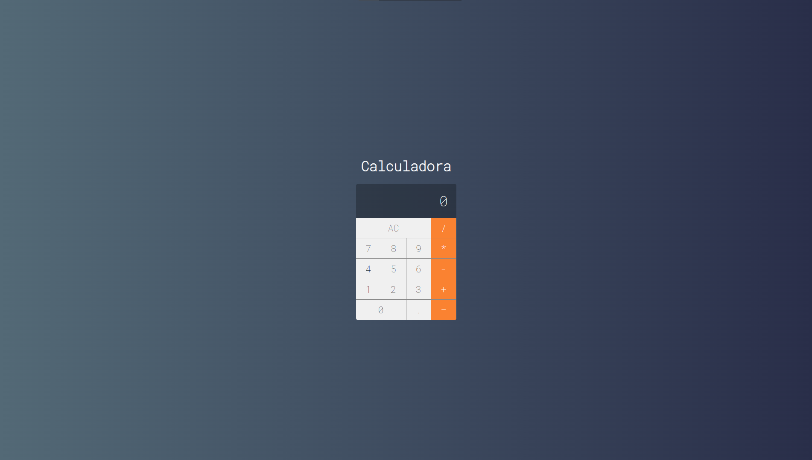

# Calculadora

Este projeto é pessoal para estudo e aprofundamento em tecnologias Web como SPA, Componentização, uso de estados e muito mais.

## Recursos

* O aplicativo foi desenvolvido com JavaScrip, CSS, HTML e React.js.

## Uso

1. Clone o repositório do GitHub.
2. Abra o projeto no seu editor de código.
3. Instale o pacote do projeto com npm install.
4. Depois de instalado os pacotes, basta dar um npm start para iniciar o projeto na porta localhost:3000.

## Créditos

Este projeto foi criado por Alaska Websites.
